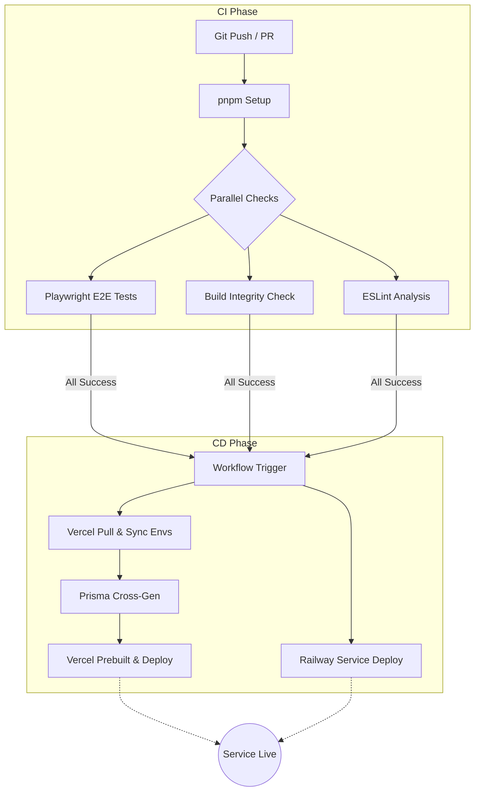

<div align="center">
    

[버그 제보](https://cromo.site/contact) · [기능 요청](https://github.com/team-croni/cromo/issues)

**"AI와 함께하는 스마트한 메모 관리"**

실시간 공유와 AI 기반의 스마트한 검색 경험을 제공하기 위해 만든 프로젝트입니다.

·

·

·

</div>

## 💡 주요 기술 요약

### 핵심 기술 스택

| 분류         | 기술                         | 설명                                              |
| ------------ | ---------------------------- | ------------------------------------------------- |
| 프론트엔드   | Next.js 15 & TypeScript      | 최신 웹 기술을 활용한 프론트엔드 개발             |
| 실시간 통신  | Node.js + Socket.io          | 실시간 공유 기능을 위한 독립형 WebSocket 서버     |
| 데이터베이스 | PostgreSQL (Neon) & pgvector | 벡터 검색 기반 의미적 검색 구현                   |
| AI 서비스    | OpenRouter/OpenAI API        | AI 기반 자동 제목 생성, 태그 추천, 요약 기능      |
| 스케줄링     | Inngest                      | 스케줄링 기반 임베딩 처리 및 백그라운드 작업 관리 |
| 배포         | Vercel & Railway             | 분산 아키텍처 기반 안정적인 서비스 배포           |

### 핵심 기능

| 기능                     | 설명                                                                   |
| ------------------------ | ---------------------------------------------------------------------- |
| 하이브리드 검색 알고리즘 | 키워드 기반 검색과 의미 기반 벡터 검색을 융합한 동적 RRF 알고리즘 구현 |
| 실시간 공유 시스템       | 서버리스 환경에서 독립 소켓 서버를 통한 안정적인 실시간 동기화         |
| AI 통합 파이프라인       | 클라우드와 로컬 모델을 적절히 조합한 비용 효율적인 AI 기능 구현        |
| 확장 가능한 아키텍처     | 수만 건의 데이터에서도 밀리초 단위 검색 성능을 보장하는 인덱싱 전략    |
| 자동화된 데이터 처리     | 해시 기반 변경 감지 및 배치 처리를 통한 효율적인 임베딩 업데이트       |

---

## 1. 프로젝트 소개

**Cromo**는 단순한 메모 기록을 넘어, 개인의 생각이나 여러 사람의 아이디어를 실시간으로 동기화하고 AI를 통해 더 가치 있게 만드는 플랫폼입니다.  
Next.js 15의 최신 기능을 활용하면서도, 실시간 동기화의 안정성을 위해 서버 구조를 분리하고, `pgvector`를 도입하여 문맥까지 찾아내는 검색 엔진을 구현했습니다.


### 1.1. 개발 배경 및 목표

기존 메모 도구들의 한계를 극복하고자 다음과 같은 목표를 설정했습니다:

- **실시간 공유의 안정성**: 서버리스 환경의 제약을 넘어 끊김 없는 실시간 동기화 제공
- **지능형 검색**: 키워드 기반 검색을 넘어 의미와 문맥을 이해하는 검색 경험
- **비용 효율적인 AI 활용**: 클라우드와 로컬 모델을 적재적소에 활용하여 비용 최적화
- **확장 가능한 아키텍처**: 사용자와 데이터가 증가해도 성능을 유지하는 시스템 설계

---

## 2. 핵심 기술

### 2.1. 실시간 기능을 위한 서버 환경의 분리

Vercel 같은 서버리스(Serverless) 환경은 배포가 간편하지만, 실시간으로 데이터를 주고받는 WebSocket 연결을 유지하기에는 기술적 제약이 있었습니다.

실시간 통신만 전담하는 **독립된 Node.js 서버(Socket.io)**를 Railway에 구축하여 연결의 안정성을 확보했습니다.

### 2.2. "의도"까지 찾아주는 하이브리드 검색

사용자가 키워드를 정확히 기억하지 못해도 원하는 메모를 찾을 수 있도록 검색 로직을 고도화했습니다.

#### 검색 방식

1. **키워드 검색**: `pg_trgm`을 활용해 오타가 있거나 단어의 일부만 입력해도 정확하게 찾아냅니다.
2. **의미 기반 검색**: `pgvector`를 도입하여 검색어와 문맥상 유사한 메모를 추천합니다.

#### 알고리즘: Dynamic RRF (Reciprocal Rank Fusion)

단순 순위 합산이 아닌, 벡터 거리(Distance)에 따른 **동적 가중치 기반 RRF** 알고리즘을 자체 구현했습니다.

- **동작 원리**: 검색어와의 문맥적 유사도가 높을수록 더 높은 가중치를 부여
- **효과**: 키워드 매칭과 의미 유사도를 균형있게 반영하여 검색 정확도 극대화
- **성능**: `HNSW(Hierarchical Navigable Small World) 인덱스` 적용으로 수만 건의 데이터에서도 밀리초(ms) 단위의 검색 성능 확보

자세한 알고리즘 및 처리 플로우는 [하이브리드 검색 알고리즘 문서](./HYBRID_SEARCH_ALGORITHM.md)를 참조하세요.

#### 검색 최적화 전략

- **인덱스 전략**: GIN 인덱스(키워드), HNSW 인덱스(벡터) 병행 사용
- **쿼리 최적화**: Prisma 쿼리를 통한 검색 로직 최적화

### 2.3. 효율적인 AI 활용 전략 (Cloud & Local)

모든 기능을 고성능 클라우드 모델로 처리할 경우 발생하는 비용 부담과 응답 지연 문제를 해결하고자 했습니다.

#### AI 모델 선택 전략

| 기능          | 사용 모델           | 특징                     |
| ------------- | ------------------- | ------------------------ |
| 임베딩 생성   | OpenRouter (Cloud)  | 고정된 모델, 높은 정확도 |
| 그 외 AI 기능 | OpenRouter / OpenAI | 병행 사용, 상황별 최적화 |

#### 안정성 및 폴백 전략

- **API 오류 대응**: OpenRouter API 장애 시 다음 Inngest 스케줄링 주기에서 재시도
- **Rate Limiting**: 요청 빈도 제한 및 대기열 관리
- **타임아웃 처리**: 10초 후 요청 취소로 응답 지연 방지
- **비용 모니터링**: API 사용량 추적 및 예산 초과 방지 로직

### 2.4. 지능형 임베딩 및 데이터 파이프라인

메모의 의미를 정확하게 추출하고 검색 효율을 극대화하기 위해 고도화된 임베딩 파이프라인을 구축했습니다.

본 시스템은 [Neon](https://neon.tech/)의 서버리스 PostgreSQL을 사용하여 확장성과 관리의 편의성을 제공하며, `pgvector` 확장을 통해 벡터 검색 기능을 구현했습니다.

임베딩 생성은 실시간 업데이트가 아닌, 서버 측 스케줄링을 통해 주기적으로 변경된 메모를 감지한 후 일괄 처리하는 방식으로 운영되어 API 비용과 시스템 부하를 줄입니다.

```mermaid
graph LR
    subgraph "1. 전처리"
        Scan[변경 감지] --> Hash{Hash 비교}
        Hash -- "일치" --> Flag["Flag 갱신"]
        Hash -- "변경" --> Batch["2개 배치"]
    end

    subgraph "2. 임베딩 생성"
        Batch --> Router{API Router}
        Router --> Cloud["OpenRouter"]
    end

    subgraph "3. 저장 및 후처리"
        Cloud --> DB[("PGVector")]
        DB -.-> AutoTag["AI 태깅"]
        AutoTag --> TagEmbed["태그 임베딩"]
        TagEmbed --> DB
    end
```



#### 이중 임베딩 구조

- **콘텐츠 임베딩**: 제목, 본문(HTML 제거), 태그 정보를 결합하여 메모의 전체적인 맥락을 벡터화 (OpenRouter 사용)
- **태그 임베딩**: 카테고리와 태그 정보만을 위한 별도 벡터 공간을 생성하여 정교한 분류 검색 지원 (OpenRouter 사용)

#### 최적화 및 동기화

- **Content Hashing**: MD5 해시 알고리즘을 통해 실제 내용 변경 여부를 감지, 불필요한 API 호출 차단 및 리소스 절약
- **Batch Processing**: Inngest 스케줄링 시 최대 2개씩 처리하여 API 부하와 시스템 부하 최소화
- **자동 카테고리화**: 임베딩 처리 완료 후 AI가 문맥을 분석하여 적절한 태그를 자동으로 할당하는 후처리 프로세스 연결

#### 임베딩 스케줄링 특징

- **실패 처리**: 임베딩 처리 실패 시 즉시 재시도하지 않고 다음 Inngest 스케줄링 주기에서 자동 재시도
- **성능 모니터링**: 각 실행 시 소요 시간을 로그에 기록하여 성능 추적 및 장기적인 작업 부하 분석 가능
- **스케줄링 주기**:
  - 임베딩 처리: 4분 주기(`0/4 * * * *`)
  - 태그 업데이트: 4분 주기(`2/4 * * * *`, 2분 지연)로 카테고리 자동 할당 우선 처리

---

## 3. 시스템 아키텍처

본 시스템은 Next.js 애플리케이션이 Vercel에, 실시간 소켓 서버가 Railway에, 스케줄링 기능이 Inngest를 통해 관리되며, 로컬 AI 모델은 LMStudio를 사용하는 분산형 아키텍처를 따릅니다.

```mermaid
graph TD
    User[사용자 클라이언트]

    subgraph "프론트엔드 & API 계층 (Vercel)"
        NextJS["Next.js App Router"]
        APIRoutes["API Routes / Serverless"]
        Vercel["Vercel 배포"]
    end

    subgraph "실시간 계층 (Railway)"
        SocketSvr["Socket Server (Node.js)"]
        SocketHandlers["Event Handlers"]
        Railway["Railway 배포"]
    end

    subgraph "스케줄링 계층 (Inngest)"
        Inngest["Inngest Functions"]
        Scheduler["Cron Jobs & Event-driven"]
    end

    subgraph "AI 계층"
        CloudAI["Cloud AI (OpenRouter)"]
        LocalAI["Local AI (OpenAI)"]
    end

    subgraph "데이터 계층"
        DB[("Neon PostgreSQL")]
        VectorStore[("Vector Store / PGVector")]
    end

    %% 연결 관계
    User -- HTTP/HTTPS --> NextJS
    User -- WebSocket (WSS) --> SocketSvr

    NextJS -- API 호출 --> APIRoutes
    APIRoutes -- Prisma --> DB

    SocketSvr -- 브로드캐스트 업데이트 --> User
    SocketSvr -- Prisma --> DB

    APIRoutes -- 텍스트 생성/분석/제목/태그 --> CloudAI
        APIRoutes -- 텍스트 생성/분석/제목/태그 --> LocalAI

    Inngest -- 데이터 처리 --> APIRoutes
    Inngest -- DB 작업 --> DB
```



### 3.1. 주요 배포 구성

- **Next.js 애플리케이션**: [Vercel](https://vercel.com/)에 배포되어 서버리스 함수 기반의 API 및 웹 인터페이스 제공
- **실시간 소켓 서버**: [Railway](https://railway.app/)에 배포되어 WebSocket 연결을 통한 실시간 공유 기능 제공
- **데이터베이스**: [Neon](https://neon.tech/)의 서버리스 PostgreSQL을 사용하여 확장성과 관리의 편의성 제공
- **백그라운드 작업 스케줄러**: [Inngest](https://www.inngest.com/)를 통해 다양한 주기적 작업 수행
  - 임베딩 처리: 4분 주기(`0/4 * * * *`), 최대 2개 배치
  - 태그 업데이트: 4분 주기(`2/4 * * * *`, 2분 지연), 최대 5개 배치
  - 데이터 정리: 매일 자정, 오래된 삭제 유저 정리
- **AI 서비스**:
  - 복잡한 분석, 요약, 자동 제목 생성, 태그 추천: OpenRouter와 OpenAI 병행
  - 임베딩 처리: OpenRouter 전용으로 정확도 향상

### 3.2. 주요 데이터 흐름

- **실시간 동기화**: `User` ➔ `Socket Server(Railway)` ➔ `Broadcast` ➔ `User` (Write-Behind로 DB 저장)
- **하이브리드 검색**: `User` ➔ `API Routes(Vercel)` ➔ `Vector Search (PGVector) + Keyword Search` ➔ `Dynamic RRF Merge` ➔ `Response`
- **임베딩 파이프라인**: `Inngest Cron(4분 주기: 0/4 * * * *)` ➔ `임베딩 업데이트 필요 메모 조회` ➔ `배치 처리(최대 2개)` ➔ `Cloud LLM Embedding(OpenRouter)` ➔ `Vector DB Update`
- **자동 태깅**: `Inngest Cron(4분 주기, 2분 지연)` ➔ `태그 업데이트 필요 메모 조회` ➔ `배치 처리(최대 5개)` ➔ `AI 카테고리 생성` ➔ `메모 태그 연결`

### 3.3. 인프라 선택 이유

각 서비스를 선택한 기술적 배경은 다음과 같습니다:

- **Vercel**: Next.js의 정적 자산 및 API 라우트를 효율적으로 처리하고, 글로벌 CDN을 통해 빠른 응답 속도와 자동 스케일링 제공
- **Railway**: 실시간 연결이 필요한 WebSocket 서버를 안정적으로 호스팅하고, 상태 유지가 필요한 작업에 최적화
- **Neon**: Serverless PostgreSQL로 자동 스케일링과 분기(Branching) 기능 제공, `pgvector` 확장 지원으로 벡터 검색 구현에 적합
- **Inngest**: 선언적 스케줄링과 실패 재시도 로직, 복잡한 비동기 작업 처리를 간편하게 구현 가능

---

## 4. 주요 기능 및 디테일

### 4.1. 실시간 공유 및 동시성 제어


_실시간 동기화와 AI 어시스턴트가 통합된 에디터 환경_

#### 동시성 제어 메커니즘

- **소켓 이벤트 기반 동기화**: WebSocket을 통한 실시간 이벤트 전달로 여러 사용자의 동시 편집 반영
- **속도 제한(Rate Limiting)**: 초당 요청 횟수 제한으로 서버 부하 방지 및 안정성 확보
- **서버 주도 업데이트**: 클라이언트 변경 사항은 서버 검증 후 다른 사용자에게 브로드캐스트

#### 권한 관리

- **실시간 권한 변경**: 메모 소유자가 편집 권한을 변경하면 소켓을 통해 공유 받은 사람들에게 즉각 반영
- **역할 기반 접근 제어**: Owner, Editor, Viewer 역할에 따른 세분화된 권한 관리
- **세션 및 연결 관리**: 사용자 연결 해제 시 관련 데이터 즉시 정리, 비활성 방 10분 후 자동 정리

### 4.2. AI 기반 스마트 기능

#### 자동 제목 생성

- 메모 내용 분석 후 핵심 주제를 파악하여 간결한 제목 자동 생성
- OpenRouter 또는 로컬 OpenAI 모델 사용

#### 지능형 태그 추천

- 메모 내용의 문맥을 분석하여 관련 카테고리/태그 자동 제안
- OpenRouter 또는 로컬 OpenAI 모델 사용

#### 요약 및 분석

- 긴 메모의 핵심 내용 자동 요약
- 키워드 추출 및 주제 분류
- OpenRouter 또는 로컬 OpenAI 모델 사용

#### 오타 수정

- 메모 내용의 오타 및 문법 오류 자동 감지 및 수정 제안
- OpenRouter 또는 로컬 OpenAI 모델 사용

---

## 5. CI/CD 파이프라인

본 프로젝트는 pnpm 환경에서 GitHub Actions를 이용해 코드 품질 검증부터 멀티 플랫폼 배포까지 자동화된 파이프라인을 구축했습니다. 특히, 테스트(CI)가 성공해야만 배포(CD)가 실행되는 의존성 구조를 통해 서비스의 안정성을 보장합니다.

### 파이프라인 흐름도



### 주요 자동화 특징

- **강력한 E2E 테스트 검증 (Playwright)**:
  - **무결성 검증**: 서비스의 핵심 사용자 흐름(로그인, 메모 생성, 검색 등)을 배포 전 매번 자동으로 검증하여 회귀 버그를 방지합니다.
  - **최적화된 캐싱**: Playwright 브라우저 바이너리를 GitHub Actions 캐시에 보관하여, 테스트 준비 시간을 매 실행마다 2~3분 이상 단축했습니다.
  - **실패 분석(Artifacts)**: 테스트 실패 시 실행 영상, 스크린샷, 상세 로그가 담긴 HTML 리포트를 GitHub 아티팩트로 자동 업로드하여 즉각적인 디버깅 환경을 제공합니다.
- **환경 변수 자동 동기화 (Single Source of Truth)**:
  - **Vercel Pull**: GitHub Secrets에 모든 변수를 수동 등록하는 대신, `vercel pull` 명령을 통해 Vercel 대시보드에 설정된 실운영 환경 변수를 빌드 시점에 안전하게 동기화합니다.
  - **보안 격리**: 개발/검증 단계(CI)에서는 더미 데이터를, 배포 단계(CD)에서는 실제 운영 데이터를 사용하는 이중화 전략을 취합니다.
- **Cross-Platform Prisma 최적화**:
  - **Multi-Binary Target**: 빌드 환경(GitHub Actions - Debian)과 실행 환경(Vercel - RHEL)의 차이로 발생하는 런타임 에러를 방지하기 위해 `schema.prisma`에서 `rhel-openssl-3.0.x`를 포함한 멀티 바이너리 생성을 자동화했습니다.
- **배포 주도권 단일화 (Orchestration)**:
  - **중복 배포 차단**: Vercel의 Ignored Build Step과 Railway의 Disconnect Branch 설정을 통해 각 플랫폼의 자체 자동 배포를 차단하고, 오직 GitHub Actions가 지휘하는 단일 배포 창구만 허용합니다.
- **성능 및 안정성**:
  - **Caching Strategy**: pnpm 스토어 및 Playwright 브라우저 바이너리 캐싱을 통해 파이프라인 실행 시간을 최적화했습니다.
  - **Atomic Deployment**: Vercel CLI의 `--prebuilt` 옵션을 사용하여 빌드된 아티팩트를 그대로 업로드함으로써 배포 시점의 변동성을 제거했습니다.

---

## 6. 프로젝트 구조

```text
/.github                   # GitHub 액션 워크플로우 및 설정 파일
/.husky                    # Git 훅 관리 도구 설정
/prisma                    # 데이터베이스 스키마 및 마이그레이션
/src                       # 프론트엔드 애플리케이션 소스 코드
  ├── app/                 # Next.js App Router (페이지 및 API)
  ├── components/          # UI 컴포넌트
  ├── services/            # 비즈니스 로직 서비스
  ├── hooks/               # React 커스텀 훅
  ├── lib/                 # 유틸리티 및 외부 라이브러리 래퍼
  ├── store/               # 상태 관리
  └── styles/              # 전역 스타일
/socket-server             # 실시간 소켓 서버
  ├── handlers/            # 소켓 이벤트 핸들러
  ├── db/                  # 데이터베이스 연결 관리
  └── utils/               # 서버 유틸리티 함수
/public                    # 정적 자산
/inngest                   # Inngest 스케줄링 함수
/scripts                   # 빌드/배포 스크립트
/tests                     # Playwright E2E 테스트 파일
```

---

## 7. 기술 스택

### Frontend

- **Framework**: Next.js 15 (App Router)
- **Language**: TypeScript
- **Styling**: Tailwind CSS
- **State Management**: Tanstack Query, Zustand
- **Real-time**: Socket.io Client

### Backend

- **API**: Next.js API Routes (Serverless)
- **Real-time Server**: Node.js + Socket.io (Railway)
- **ORM**: Prisma
- **Database**: PostgreSQL (Neon)
- **Vector Search**: pgvector + HNSW Index
- **Scheduling**: Inngest

### AI/ML

- **Cloud Models**: OpenRouter API
- **Local Models**: OpenAI Compatible Models
- **Embedding**: Text-Embedding Models via OpenRouter
- **NLP**: Custom RRF Algorithm for Hybrid Search

### DevOps & Infrastructure

- **Deployment**: Vercel (Frontend), Railway (WebSocket)
- **Version Control**: Git
- **CI/CD**: GitHub Actions
- **Monitoring**: Inngest Dashboard, Axiom

---

<div align="center">

© 2026 [Croni](https://github.com/team-croni). All rights reserved.

</div>
